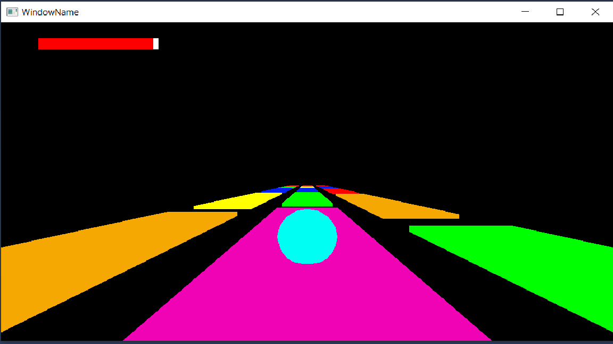

#                                   *Skyroads*

This game is implemented in C++ and the source code can be found in **Source/Laboratoare/Tema2**. 
This can be opened in Visual Studio 2017. You have to open the Visual Studio/Framework_EGC.sln file.
The plates have more colors which modify the fuel of the player.
When the ball lands on a plate, that one changes its colour in purple.

If the ball hits a plate with the following color:

RED : the game will stop

BLUE: nothing is going to happen

GREEN: fuel increasing

YELLOW: fuel decreasing

ORANGE: the speed of the ball is automatically increasing for a few seconds

The ball functionalities are various and can be controlled by keyboard:

W : increasing the speed of the ball

S : decreasing the speed of the ball

A : left moving

D : right moving

SPACE: jumping

       
       
      

       
       
       
       
       
       
       
       
       
       
       
       
       
       
       
       
       
       
       
       
      

       
       

